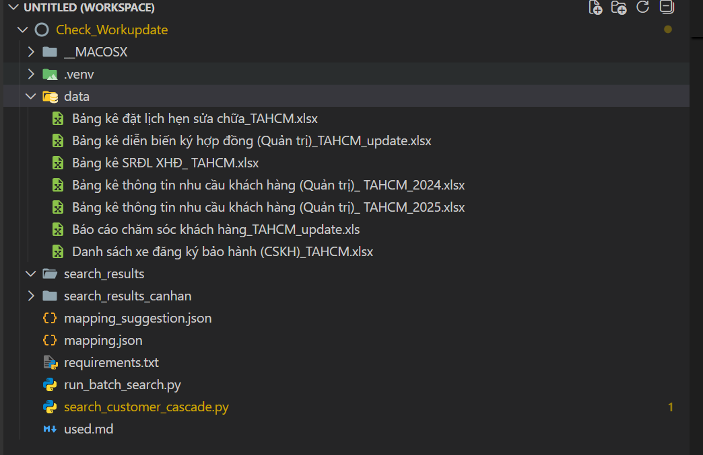

# ----------------------------------------------------------------
# LẦN ĐẦU
# Tạo venv
python -m venv .venv

# Chạy venv
.\.venv\Scripts\activate

# Tải thư viên 
pip install -r requirements.txt

# ----------------------------------------------------------------
# ĐÃ CÓ VENV

# Chạy venv
.\.venv\Scripts\activate

# Tìm theo mã số thuế
python search_customer_cascade.py --query 0102306332

# Tìm theo chứng mình nhân dân
python search_customer_cascade.py -q 0318558269 -t id

# Tìm theo tel
python search_customer_cascade.py -q 0318558269 -t tel

# Chạy theo số lượng nhiều (Nhớ đổi thông tin trong file run_batch_search.py)
python run_batch_search.py

# Các file data
